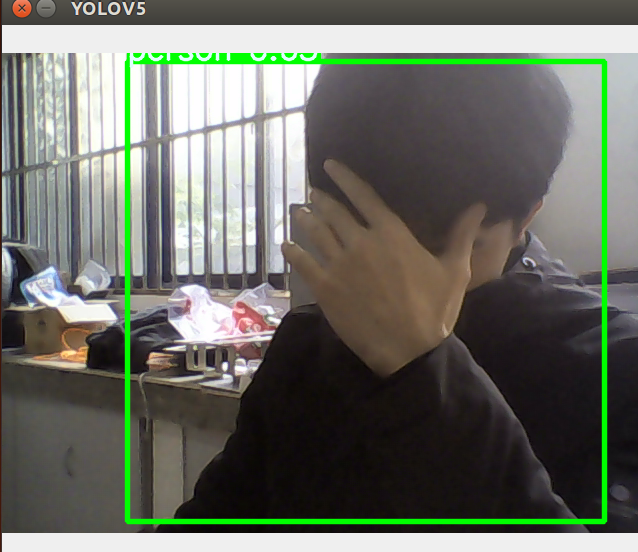

# yolov5_ROS
this is and successfull ros package，which can run YOLOv5 in ROS 

# 1:requirements
①an conda env called yolo,in which you can run yolov5 dependently  
②ROS kinetic, ubuntu16.04  
③basic usb_cam ROS_driver  
④yolov5s.pth or else ***(if you dont't have it,it will automatically donwload to your system)***

# 2:before run
```
1:copy this package(ros_yolo) to your catkin_ws/src  
2:catkin_make  
3:in final_yolo.py, you need to change the image_topic to your own camera input topic  
```

# 3:command to run
```
1:roscore
2:rosrun usb_cam usb_cam_node  
3:yolo                               #enter into your conda env
4:rosrun ros_yolo final_yolo.py  
```
# 4:results



